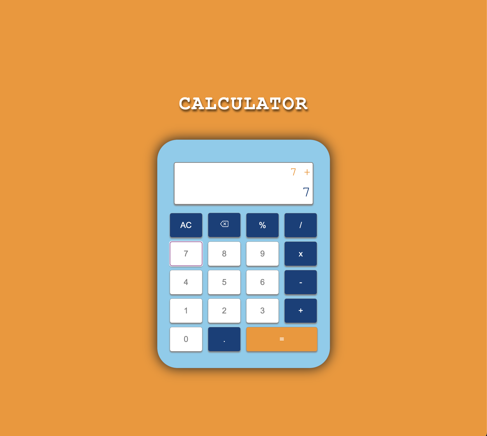

## Calculator

This is a calculator web app that allows users to compute mathematical operations using addition, subtraction, division and/or multiplication operators. Users can clear the whole calculator screen, delete one digit at a time, enter decimal numbers and percent values.

Live Demo: https://miarothman.github.io/calculator/

Built Using:
- HTML5
- CSS3
- Javascript

Screenshot:    

